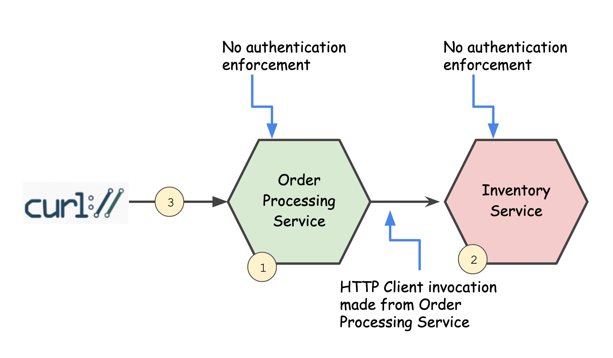

## Service service communication without authentication



* **Step:0** Clone the git repo with the following command. If you are new to Ballerina, please check this out: https://ballerina.io/. Ballerina version: 1.1.0

```javascript
:\> git clone https://github.com/prabath/ballerina-security.git
```

* **Step:1** To start the Order Processing microservice, run the following command from the directory **service-service-communication**. This will start the service on HTTPS port 9008.

```javascript
:\> sh 1-run-order-processing.sh
```
* **Step:2** To start the Inventory microservice, run the following command from the directory **service-service-communication**. This will start the service on HTTPS port 9009.

```javascript
:\> sh 2-run-inventory.sh
```
* **Step:3** Run the following command from the directory **service-service-communication** to invoke the Order Processing microservice.

```javascript
:\> sh 3-call-order-processing.sh

{"status":"order created successfully"}
```
