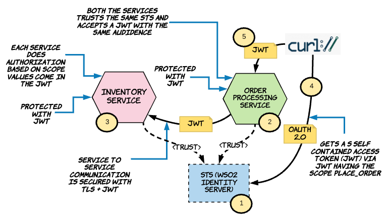

## Securing Service to Service Communication Over TLS with JWT



* **Step:0** Clone the git repo with the following command.

```javascript
:\> git clone https://github.com/prabath/ballerina-security.git
```

* **Step:1** To start WSO2 Identity Server as a Docker container, run the following command from the directory service-service-auth-with-jwt. This will spin up Identity Server (STS) and to make sure it is started properly, try to access the URL https://localhost:9443 from the browser and it should show the home page. In case you change port mapping in 1-run-sts.sh, make sure to change the corresponding port in 4-get-jwt-from-sts.sh. By default Identity Server starts on port 9443.

```javascript
:\> sh 1-run-sts.sh
```
* **Step:2** To start the Order Processing microservice, run the following command from the directory service-service-auth-with-jwt. This will start the service on HTTP port 9008.

```javascript
:\> sh 2-run-order-processing.sh
```
* **Step:3** To start the Inventory microservice, run the following command from the directory service-service-auth-with-jwt. This will start the service on HTTP port 9009.

```javascript
:\> sh 3-run-inventory.sh
```
* **Step:4** Run the following command from the directory service-service-auth-with-jwt to get JWT from the STS. Here we are using OAuth 2.0 password grant type to get the JWT. We use this only for the demo purpose - and in a production setup, you should try not to use the password grant type. Anyway, a JWT obtained from any of the grant type should be fine.

```javascript
:\> sh 4-get-jwt-from-sts.sh
```
*Now, we need to copy the value of the access_token parameter, from the above response and export it as TOKEN to the shell environment. The value of the TOKEN environment variable is referred by 5-call-order-processing.sh.

```javascript
:\> export TOKEN=
```
* **Step:5** Run the following command from the directory service-service-auth-with-jwt to invoke rge Order Processing microservice.

```javascript
:\> sh 5-call-order-processing.sh
```